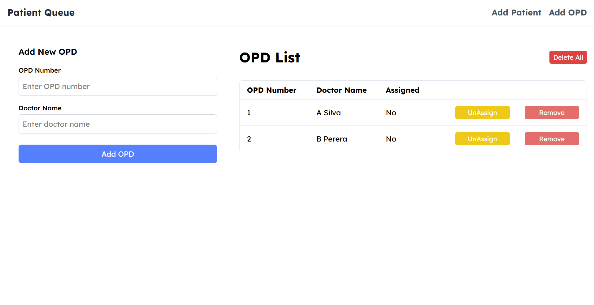
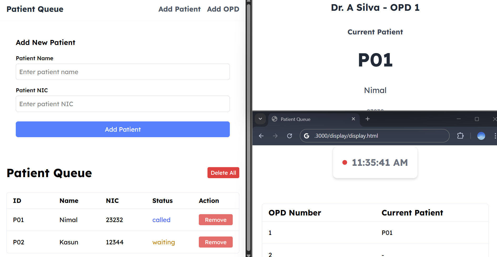
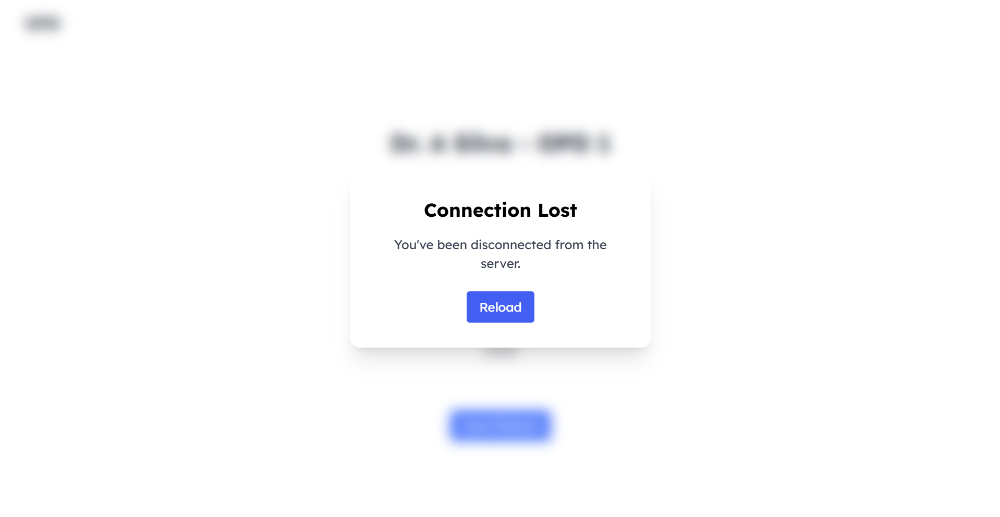

# Hospital Queue System

A web-based hospital queue management system providing real-time updates for patients, doctors, and admins.  
Designed for use within a hospital's local area network (LAN), this system ensures fast, reliable communication between all roles without relying on external internet connectivity.  
It features a modular architecture with separate admin, doctor, and display interfaces, all synchronized via Socket.IO for instant updates.  
The backend uses Node.js, Express, and MongoDB for robust data management, while the frontend leverages React and Tailwind CSS for a modern, responsive UI.  
Overall, the project demonstrates good separation of concerns, real-time event handling, and test coverage, making it suitable for small to medium hospital environments. 

---

## Features
- **Patient Registration & Queue Management:** Patients can be registered and managed in a queue system.
- **Previous Day Patients Auto-Cleared:** Patients from previous days are automatically removed when the system starts.
- **Real-Time Updates:** Doctors and display screens receive live updates via Socket.IO.
- **Admin Dashboard:** Admins can add, remove, and manage OPDs and patients.
- **Responsive Design:** Works on desktop and mobile devices.
- **Tailwind CSS Styling:** Modern, clean UI.

---

## Screenshots

### Admin Panel (Doctors assigned to OPDs)

Shows doctors who are assigned to OPDs.

### Live System (Admin, Display, Doctor UI)

Demonstrates how the admin, display, and doctor OPD UIs work together in real time.

### Connection Lost Example

Shows how the system behaves if the connection is lost.

---

## Architecture

```
backend/         # Node.js/Express backend (Socket.IO, MongoDB)
  config/        # Database connection and cleanup
  models/        # Mongoose models (Opd, Patient)
  socket/        # Socket.IO event handlers (numbered logic)
frontend/
  admin/         # Admin React app (Vite)
  display/       # Public display HTML/JS
  doctor/        # Doctor dashboard HTML/JS
  shared/        # Shared frontend JS (config, dialogs)
```

---

## Backend Logic Overview

The backend is built with Node.js, Express, MongoDB (via Mongoose), and Socket.IO for real-time communication.

### Main Socket.IO Event Flow

1. **Doctor OPD Selection**
   - Doctor connects and registers role (`register_role: doctor`).
   - Requests available OPDs (`get_available_opds`).
   - Receives list (`available_opds`).
   - Selects OPD (`select_opd`).
   - OPD is assigned (`opd_assigned`).
   - If a patient is available, doctor receives (`patient_called`).

2. **Patient Registration**
   - Admin registers a patient (`add_patient`).
   - Patient is added to queue.
   - If a free OPD exists, patient is auto-assigned (`assignNextPatientToOpd`).
   - Doctor receives (`patient_called`).

3. **OPD Management**
   - Admin adds OPD (`add_opd`).
   - All clients receive (`opd_list_updated`).
   - Admin can unassign or delete OPDs (`unassign_opd`, `delete_opd`, `delete_all_opds`).
   - Unassigning marks current patient as done and clears OPD.

4. **Patient Queue Management**
   - Admin requests all patients (`get_patients`).
   - Receives (`patients_list`).
   - Deleting a patient triggers OPD cleanup and auto-assigns next patient if needed.

5. **Doctor Unassignment**
   - If doctor disconnects, OPD is auto-unassigned.
   - All clients receive (`opd_list_updated`).

6. **Doctor Calls Next Patient**
   - Doctor clicks "Next Patient" (`next_patient`).
   - Current patient marked as done, next patient assigned if available.
   - Doctor receives (`patient_called`).
   - All clients receive (`patient_list_updated`).

7. **Display Screen**
   - Display registers role (`register_role: display`).
   - Requests display data (`get_display_data`).
   - Receives (`display_data`) with OPD and current patient info.
   - Updates on (`opd_list_updated`, `patient_list_updated`).

---

## Setup

### 1. Backend

```sh
cd backend
npm install
node server.js
```

- MongoDB must be running locally (`mongodb://localhost:27017/hospital-queue`).
- Old patients are auto-cleaned daily on server start.
- **Configuration:**  
  Create a `config.js` file in the backend directory with:

  ```js
  // config.js
  const SOCKET_SERVER = 'http://localhost:3000'; // or your server URL
  ```

### 2. Frontend (Admin)

```sh
cd frontend/admin
npm install
npm run dev
```

- Runs on Vite dev server (default: `http://localhost:5173`).
- **Environment Variable:**  
  Create a `.env` file in `frontend/admin` with:
  
  ```
  VITE_SOCKET_URL=http://localhost:3000
  ```

### 3. Display & Doctor

- Open `frontend/display/display.html` and `frontend/doctor/doctor.html` in your browser.
- Can be served via static server or opened directly.

---

## Usage

### Admin Panel

- Add patients and OPDs.
- View, unassign, or delete OPDs.
- View and delete patients.

### Doctor Dashboard

- Select available OPD.
- View current patient details.
- Call next patient.

### Display Screen

- Shows live OPD queue and current patient for each OPD.

---

## Development

- **Styling:** Tailwind CSS (`/public/tailwind.css`)
- **Real-Time:** Socket.IO for all live updates.
- **React:** Admin panel built with React + Vite.
- **MongoDB:** Data persistence for patients and OPDs.

---

## File References

- **Backend Socket Logic:** [`backend/socket/opdHandlers.js`](backend/socket/opdHandlers.js), [`backend/socket/patientHandlers.js`](backend/socket/patientHandlers.js), [`backend/socket/displayHandlers.js`](backend/socket/displayHandlers.js), [`backend/socket/autoAssigner.js`](backend/socket/autoAssigner.js)
- **Models:** [`backend/models/Opd.js`](backend/models/Opd.js), [`backend/models/Patient.js`](backend/models/Patient.js)
- **Frontend Admin:** [`frontend/admin/src`](frontend/admin/src)
- **Doctor UI:** [`frontend/doctor/doctor.html`](frontend/doctor/doctor.html), [`frontend/doctor/script.js`](frontend/doctor/script.js)
- **Display UI:** [`frontend/display/display.html`](frontend/display/display.html), [`frontend/display/script.js`](frontend/display/script.js)

---

## Screenshots

### Admin Panel (Doctors assigned to OPDs)

Shows doctors who are assigned to OPDs.

### Live System (Admin, Display, Doctor UI)

Demonstrates how the admin, display, and doctor OPD UIs work together in real time.

### Connection Lost Example

Shows how the system behaves if the connection is lost.

---


